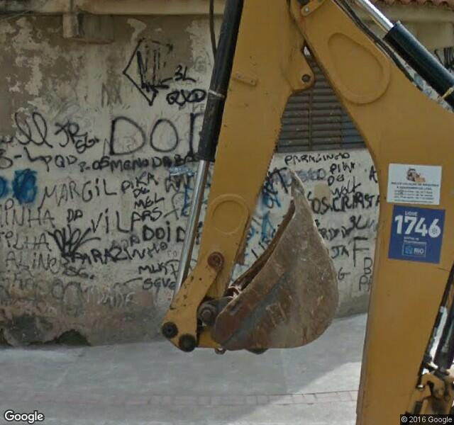

# streetview_getImage

script em python para pegar imagem do street view usando o Street View Image API 
https://developers.google.com/maps/documentation/streetview/?hl=en

first based on: https://andrewpwheeler.wordpress.com/tag/google-streetview-api/
